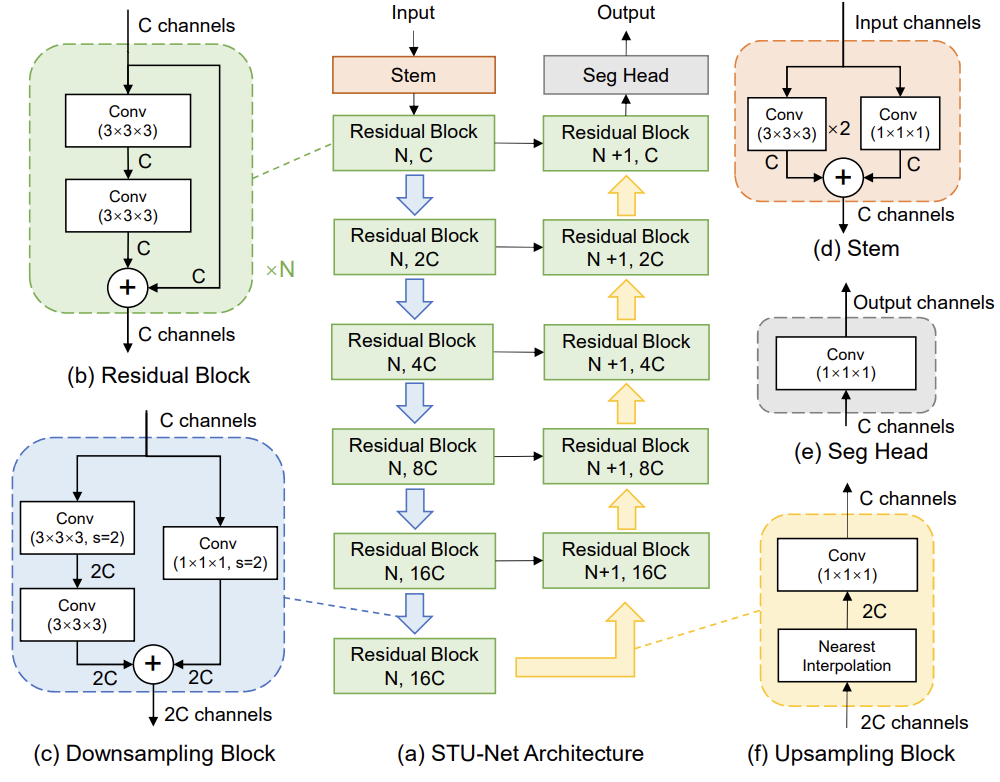
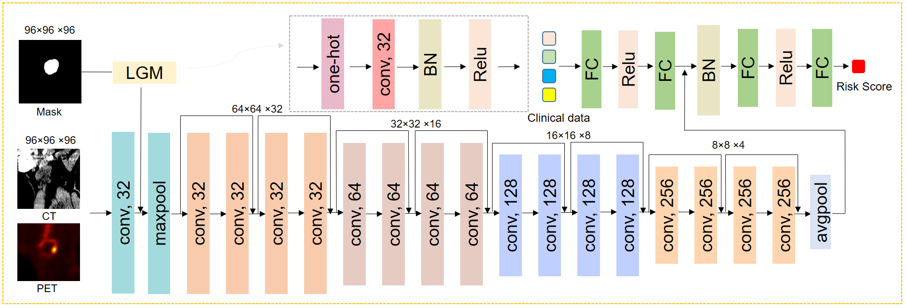

# HECKTOR 2025 – Team MEDAI 🏆
[](https://www.python.org/) [](LICENSE) [](https://github.com/MIC-DKFZ/nnUNet)

🏆 Top-1 Solution for Segmentation and Detection of Head and Neck Cancer (HNC) Tumors  

This repository contains our solutions for the three tasks of the **HECKTOR 2025 Challenge**.


[👉 HECKTOR 2025 Challenge Website](https://hecktor25.grand-challenge.org/)  

---

## 📖 Overview  
This repository contains our approaches for:  
1. **Task 1 – GTVp and GTVn Segmentation**  
2. **Task 2 – Recurrence-Free Survival Prediction**  
3. **Task 3 – HPV Status Prediction**  

For official data, task descriptions, and challenge details, please refer to the [HECKTOR 2025 challenge page](https://hecktor25.grand-challenge.org/).  

---

## 🛠️ Data Preprocessing  
See: [`preprocessing.py`](preprocessing.py)  

- All images were **resampled** to **1 × 1 × 1 mm³**  
- **Overlapping bounding boxes** between CT and PET volumes were computed  
- A **region of interest (ROI)** was automatically defined using PET intensities  
- The **top portion** of the PET scan was analyzed to locate the **largest high-intensity region**  
- The **crop center** was set at the **centroid** of this region  
- A **fixed-size crop (200 × 200 × 310)** was extracted for CT, PET, and masks  

---

## 🔬 Methods  

### Task 1 – GTVp & GTVn Segmentation

All the models were trained from the scratch, no pretrained weights were used in this study.

We used **STU-Net (Small)**. The official implementation is available [here](https://github.com/uni-medical/STU-Net/tree/main/nnUNet-2.2).




#### ⚙️ Installation
```bash
cd STU-Net
pip install -e .

# Plan and preprocess the dataset
nnUNetv2_plan_and_preprocess -d <dataset_number>

# Train the model
nnUNetv2_train <dataset_number> 3d_fullres Fold -tr STUNetTrainer_small
```

### Task 2&3 – Recurrence-Free Survival Prediction  & HPV Status Prediction 


---

## 📑 Citation  

If you find our work useful, please consider citing our article:  
@inproceedings{cailess,
  title={Less is More: Efficient PET/CT Segmentation and Multimodal Prediction of Recurrence-Free Survival and HPV Status in Head and Neck Cancer},
  author={Cai, Lishan and Liang, Xinglong and Zhang, Tianyu and Huang, Jiaju and Tan, Tao and Yin, Yunchao},
  booktitle={Fourth Head and Neck Cancer Tumor Lesion Segmentation, Diagnosis and Prognosis}
}
  

---

For model weights of Task1, you can find here [here](https://drive.google.com/drive/folders/1T3NG58F24NX4C_qCHzrst1CTNviJIyuu?usp=drive_link)

## 🐳 Docker Containers  

We provide pre-built Docker images to ensure reproducibility.  
To request access, please contact us by [✉️](mailto:lishancai21@gmail.com)  

---


